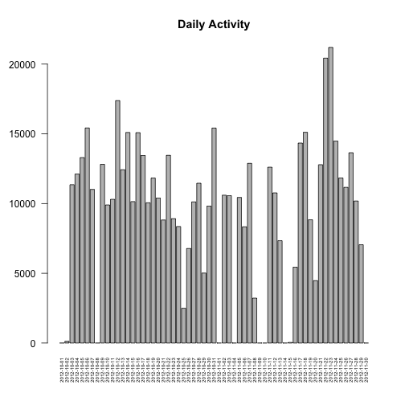
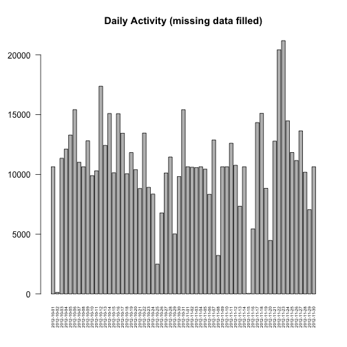
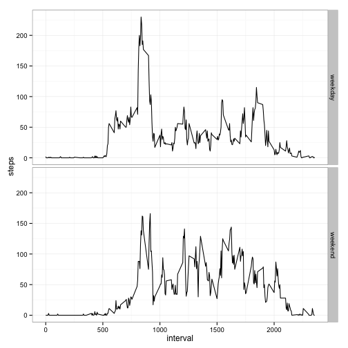

This assignment makes use of data from a personal activity monitoring device. This device collects data at 5 minute intervals through out the day. The data consists of two months of data from an anonymous individual collected during the months of October and November, 2012 and include the number of steps taken in 5 minute intervals each day.

##Data

The data for this assignment can be downloaded from the course web site:
-Dataset: [Activity monitoring data](https://d396qusza40orc.cloudfront.net/repdata%2Fdata%2Factivity.zip)
The variables included in this dataset are:

- steps: Number of steps taking in a 5-minute interval (missing values are coded as NA)
- date: The date on which the measurement was taken in YYYY-MM-DD format
- interval: Identifier for the 5-minute interval in which measurement was taken

The dataset is stored in a comma-separated-value (CSV) file and there are a total of 17,568 observations in this dataset.

##Assignment
###Loading and preprocessing the data
Set working directory and load data

```r
setwd("/Users/Meiling/Work/projects/Reproducible/")
activity<-read.csv("activity.csv")
head(activity)
```

```
##   steps       date interval
## 1    NA 2012-10-01        0
## 2    NA 2012-10-01        5
## 3    NA 2012-10-01       10
## 4    NA 2012-10-01       15
## 5    NA 2012-10-01       20
## 6    NA 2012-10-01       25
```

###What is mean total number of steps taken per day?
Caculate the daily total number of steps taken, 

```r
dates <- levels(activity$date)
temp_daily_activity <- aggregate(activity[,1],by=list(date=activity$date),na.rm=TRUE,FUN = "sum")
daily_activity <- temp_daily_activity$x
names(daily_activity) <- dates
head(daily_activity)
```

```
## 2012-10-01 2012-10-02 2012-10-03 2012-10-04 2012-10-05 2012-10-06 
##          0        126      11352      12116      13294      15420
```
then create histogram of the total number of steps taken each day

```r
barplot(daily_activity,main = "Daily Activity",las=2,cex.names=0.5)
```

 

Calculate and report the mean total number of steps taken per day

```r
mean_steps <- floor(mean(daily_activity))
mean_steps
```

```
## [1] 9354
```
and the median total number of steps taken per day

```r
median_steps <- floor(median(daily_activity))
median_steps
```

```
## [1] 10395
```
###What is the average daily activity pattern?

Create a vector variable interval_activity to store the daily average interval steps 

```r
temp_interval_activity <- aggregate(activity[,1],by=list(interval=activity$interval),na.rm=TRUE,FUN = "mean")
interval_activity <- floor(temp_interval_activity$x)
intervals <- unique(activity$interval)
names(interval_activity) <- as.character(intervals)
```
create time series plot of the 5-minute interval (x-axis) and the average number of steps taken, averaged across all days and highlight the interval contains the maximumn number of steps on average across all the days in the dataset

```r
plot(interval_activity,type="l",main="Average Steps in Each Interval (across all days)",xlab="interval",ylab="Steps",xaxt='n')
axis(side=1,labels=as.character(intervals[seq(1,to=length(intervals),by=5)]),at=seq(1,to=length(intervals),by=5),cex.axis=0.8)
max_interval <- which(interval_activity == max(interval_activity))
paste("The maximumn number of steps on average across all the days is", floor(interval_activity[max_interval]), "in interval",names(max_interval))
```

```
## [1] "The maximumn number of steps on average across all the days is 206 in interval 835"
```

```r
#Highlight maximum point
points(interval_activity[max_interval],x=max_interval,col="red")
text(max_interval,interval_activity[max_interval] , paste("Interval: ",names(max_interval) ),  adj=c(-0.1,2))
text(max_interval,interval_activity[max_interval] , paste("Steps: ",floor(interval_activity[max_interval]) ),  adj=c(-0.1,0.5))
```

 

###Imputing missing values

Note that there are a number of days/intervals where there are missing values (coded as NA). The presence of missing days may introduce bias into some calculations or summaries of the data.

Calculate and report the total number of missing values in the dataset (i.e. the total number of rows with NAs)


```r
writeLines("The total number of missing values in the dataset are: " )
```

```
## The total number of missing values in the dataset are:
```

```r
colSums(is.na(activity))
```

```
##    steps     date interval 
##     2304        0        0
```

Devise a strategy for filling in all of the missing values in the dataset. The strategy does not need to be sophisticated. For example, you could use the mean/median for that day, or the mean for that 5-minute interval, etc.

Create a new dataset that is equal to the original dataset but with the missing data filled in with the average steps in each intervals (across all days)

```r
activity_filled <- activity
index_rows <-  which(is.na(activity$steps))

in_temp <- match(activity$interval[index_rows],intervals)
activity_filled$steps[index_rows] <- interval_activity[in_temp]
```

Make a histogram of the total number of steps taken each day and Calculate and report the mean and median total number of steps taken per day. Do these values differ from the estimates from the first part of the assignment? What is the impact of imputing missing data on the estimates of the total daily number of steps?


```r
temp_daily_activity_filled <- aggregate(activity_filled[,1],by=list(date=activity_filled$date),na.rm=TRUE,FUN = "sum")
daily_activity_filled <- temp_daily_activity_filled$x
names(daily_activity_filled) <- dates
head(daily_activity_filled)
```

```
## 2012-10-01 2012-10-02 2012-10-03 2012-10-04 2012-10-05 2012-10-06 
##      10641        126      11352      12116      13294      15420
```
then create histogram of the total number of steps taken each day

```r
barplot(daily_activity_filled,main = "Daily Activity (missing data filled)",las=2,cex.names=0.5)
```

 

Calculate and report the mean total number of steps taken per day

```r
mean_steps_filled <- floor(mean(daily_activity_filled))
mean_steps_filled 
```

```
## [1] 10749
```
and the median total number of steps taken per day

```r
median_steps_filled  <- floor(median(daily_activity_filled))
median_steps_filled 
```

```
## [1] 10641
```
###Are there differences in activity patterns between weekdays and weekends?

For this part the weekdays() function may be of some help here. Use the dataset with the filled-in missing values for this part.

Create a new factor variable in the dataset with two levels – “weekday” and “weekend” indicating whether a given date is a weekday or weekend day.

```r
day_week <- weekdays(as.Date(activity_filled$date))
i_weekend <- day_week %in% c("Saturday","Sunday")

weekdays <- matrix(,nrow=length(activity_filled$date),ncol=1)
weekdays[i_weekend] <-"weekend"
weekdays[!i_weekend]<-"weekday"
weekdays <- as.factor(weekdays)

activity_f_weekend <- data.frame(activity_filled,weekdays)


interval_activity_f<- aggregate(activity_f_weekend[,1],
                         by=list(interval=activity_f_weekend$interval,
                                 weekdays=activity_f_weekend$weekdays),
                         na.rm=TRUE,FUN = "mean")
interval_activity_f$x <- floor(interval_activity_f$x)
names(interval_activity_f)[3]<-"steps"
head(interval_activity_f)
```

```
##   interval weekdays steps
## 1        0  weekday     2
## 2        5  weekday     0
## 3       10  weekday     0
## 4       15  weekday     0
## 5       20  weekday     0
## 6       25  weekday     1
```

Make a panel plot containing a time series plot (i.e. type = "l") of the 5-minute interval (x-axis) and the average number of steps taken, averaged across all weekday days or weekend days (y-axis). The plot should look something like the following, which was creating using simulated data:

```r
library(ggplot2)
ggplot(interval_activity_f,aes(x=interval,y=steps)) + geom_line() + facet_grid (weekdays~.) + theme_bw()
```

 

